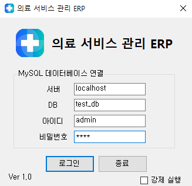
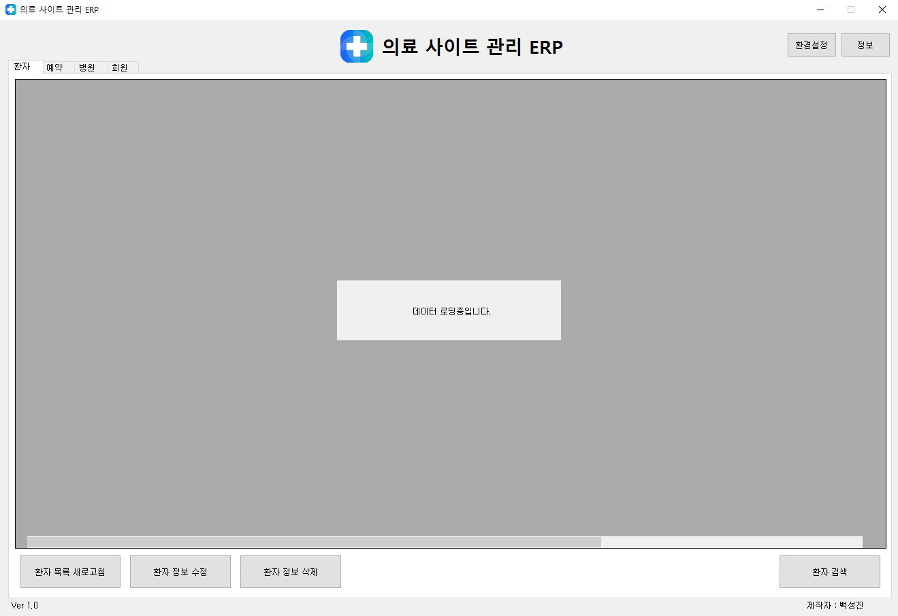
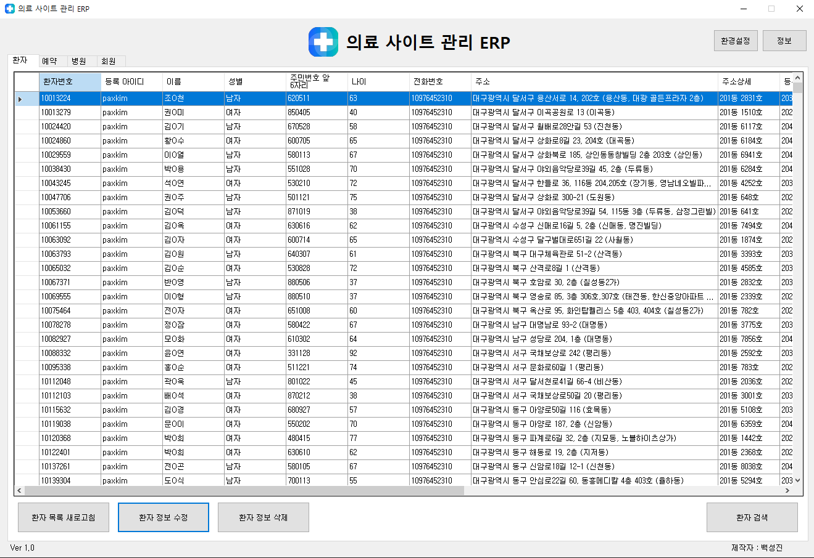
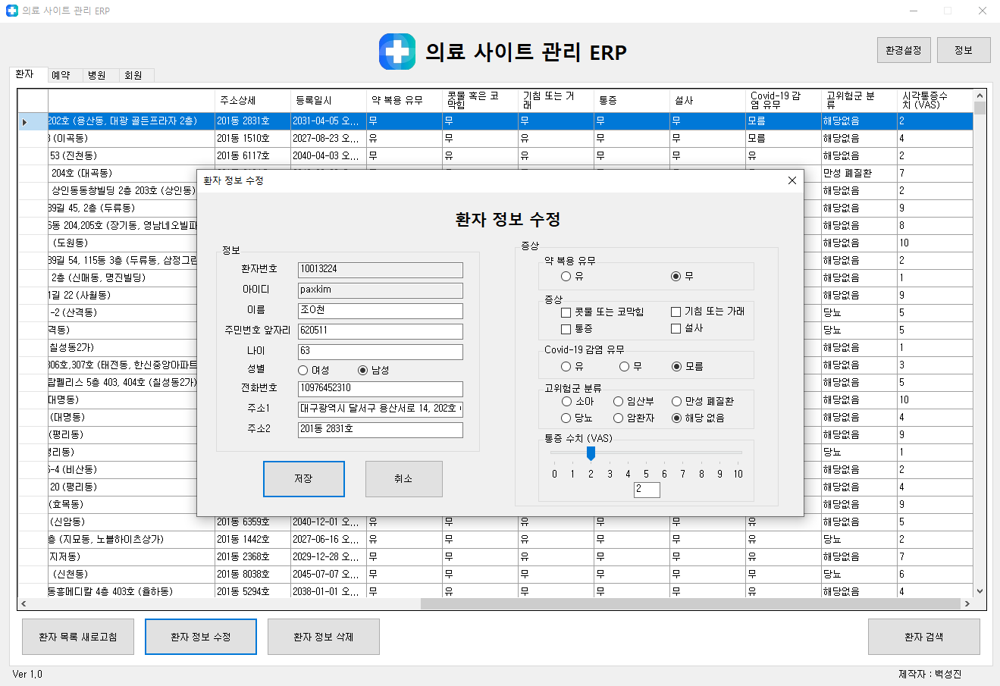

### - 프로젝트명
- 병원 의료 서비스 관리 ERP 프로그램 (의료 서비스 웹 사이트 프로젝트 연계)

### - 개발 환경
- C#, MySQL DB, Visual Studio 2022

### - 주요 기능
- 의료 웹 사이트에서 사용자가 등록한 문진표(환자) 및 예약 정보를 검색, 수정, 삭제 기능
- 의료 웹 사이트에서는 조작 불가능한 병원 데이터 삽입, 수정, 삭제, 검색 기능
- 의료 웹 사이트에서 가입된 회원들의 정보 검색 및 회원 삭제 기능

### - 구동 과정
#### 1. 프로그램 시작, DB 접속

```c#
public partial class login_form : Form
{
    private string server;
    private string database;
    private string id;
    private string pw;
    private string connectionString;
    private MySqlConnection conn;

    public login_form()
    {
        InitializeComponent();
    }
    private void login_form_Load(object sender, EventArgs e)
    {
        login_pw_value.Focus();
    }
    private void login_button_Click(object sender, EventArgs e)
    {
        server = login_server_value.Text;
        database = login_db_value.Text;
        id = login_id_value.Text;
        pw = login_pw_value.Text;
        bool tf = false;    // 로그인 결과를 저장할 변수
        connectionString = $"Server={server};Database={database};Uid={id};Pwd={pw};";
        conn = new MySqlConnection(connectionString);
        try
        {
            conn.Open();
            MessageBox.Show("접속에 성공 하였습니다.");
            tf = true;

        }
        catch (Exception ex)
        {
            MessageBox.Show("접속에 실패 하였습니다.\n" + ex.Message);
            
        }
        finally
        {
            conn.Close();
        }

        if (tf == true)     // 로그인 성공시
        {
            main_form main_form = new main_form(server, database, id, pw);
            this.Hide();    // 닫으면 프로그램이 종료되므로 숨겨야함
            main_form.Show();
            main_form.FormClosed += (s, args) => this.Close();      // 프로그램 종료시 로그인 폼 프로세스가 유지되는 현상을 막기위해 추가
        }
    }
```

- 프로그램 실행시 먼저 로그인 폼이 실행되며, MySQL DB 로그인 정보를 입력하여 DB 서버 접속 및 프로그램 실행이 가능합니다.


#### 2. 데이터 로드


```c#
public main_form(string login_server, string login_database, string login_id, string login_pw)
{
    InitializeComponent();
    server = login_server; // 로그인 폼에서 입력한 값을 전달 받음
    database = login_database;
    id = login_id;
    pw = login_pw;
    connectionString = $"Server={server};Database={database};Uid={id};Pwd={pw};";
    conn = new MySqlConnection(connectionString);
    progressform = new ProgressForm(); // 데이터 로딩중 문구를 띄울 폼
}

private async void main_form_Load(object sender, EventArgs e) // 비동기를 사용하지 않으면 progressform이 정상 작동하지 않고 멈추므로 비동기 작업 사용
{
    progressform.Show();
    await LoadDataAsync(); // 전체 데이터를 비동기로 로드
    progressform.Close();
}

private async Task LoadDataAsync()
{
    await Task.Run(() =>
    {
        LoadPatientInfo();  // 각 DB 정보를 불러오는 함수
        LoadAppointmentInfo();
        LoadHospitalList();
        LoadUserInfo();
    });
}

// 환자 정보 로드
private void LoadPatientInfo()
{
    string query = "SELECT p_id AS '환자번호', " +
        "p_user_id AS '등록 아이디', " +
        "p_name AS '이름', " +
        "CASE WHEN p_gender = 0 THEN '남자' WHEN p_gender = 1 THEN '여자' ELSE '알 수 없음' END AS '성별', " +
        "p_reg_num AS '주민번호 앞 6자리', " +
        "p_age AS '나이', " +
        "p_phone AS '전화번호', " +
        "p_address1 AS '주소', " +
        "p_address2 AS '주소상세', " +
        "p_insert_date_time AS '등록일시', " +
        "CASE WHEN p_taking_pill = 0 THEN '무' WHEN p_taking_pill = 1 THEN '유' ELSE '알 수 없음' END AS '약 복용 유무', " +
        "CASE WHEN p_nose = 0 THEN '무' WHEN p_nose = 1 THEN '유' ELSE '알 수 없음' END AS '콧물 혹은 코막힘', " +
        "CASE WHEN p_cough = 0 THEN '무' WHEN p_cough = 1 THEN '유' ELSE '알 수 없음' END AS '기침 또는 거래', " +
        "CASE WHEN p_pain = 0 THEN '무' WHEN p_pain = 1 THEN '유' ELSE '알 수 없음' END AS '통증', " +
        "CASE WHEN p_diarrhea = 0 THEN '무' WHEN p_diarrhea = 1 THEN '유' ELSE '알 수 없음' END AS '설사', " +
        "CASE WHEN p_covid19 = 0 THEN '무' WHEN p_covid19 = 1 THEN '유' WHEN p_covid19 = 2 THEN '모름' ELSE '알 수 없음' END AS 'Covid-19 감염 유무', " +
        "CASE WHEN p_high_risk_group = 0 THEN '59개월 이하의 소아' " +
        "WHEN p_high_risk_group = 1 THEN '임산부' " +
        "WHEN p_high_risk_group = 2 THEN '만성 폐질환' " +
        "WHEN p_high_risk_group = 3 THEN '당뇨' " +
        "WHEN p_high_risk_group = 4 THEN '암환자' " +
        "WHEN p_high_risk_group = 5 THEN '해당없음' " +
        "ELSE '알 수 없음' END AS '고위험군 분류', " +
        "p_vas AS '시각통증수치 (VAS)' " +
        "FROM patient";

    LoadData(query, patient_list, (dataTable) =>
    {
        patient_list.AutoSizeColumnsMode = DataGridViewAutoSizeColumnsMode.None;
        patient_list.Columns["주소"].Width = 400;
    });
}
// 여러 데이터 로드 함수의 재사용되는 코드를 줄이고자 다음과 같이 개선
private void LoadData(string query, DataGridView dataGrid, Action<DataTable> customizeColumns = null)
{
    try
    {
        conn.Open();
        MySqlDataAdapter adapter = new MySqlDataAdapter(query, conn);
        DataTable dataTable = new DataTable();
        adapter.Fill(dataTable);
        dataGrid.Invoke(new Action(() => { dataGrid.DataSource = dataTable; }));
        customizeColumns?.Invoke(dataTable);  // 컬럼 길이 조정
    }
    catch (Exception ex)
    {
        MessageBox.Show("Error: " + ex.Message);
    }
    finally
    {
        conn.Close();
    }
}
```
- 로그인 성공시 메인폼이 실행되며, 전체 DB를 불러옵니다.

#### 4. 환자 정보 데이터 수정 기능

```c#

```
