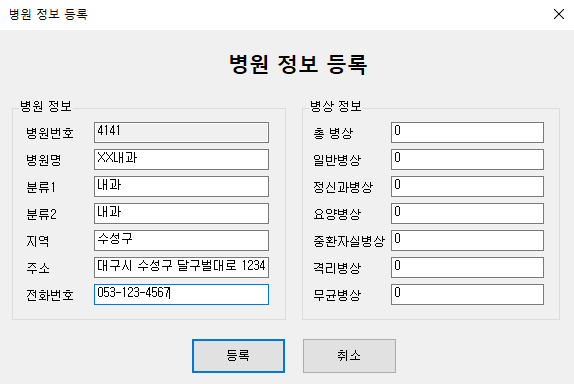
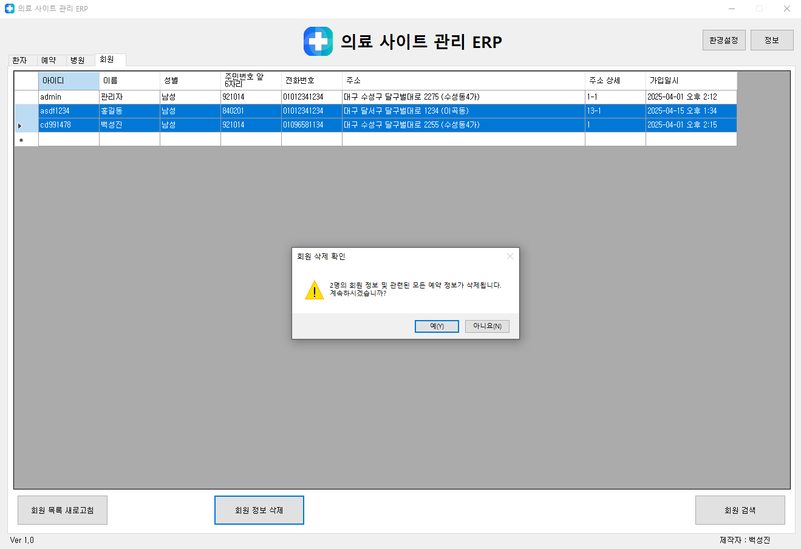
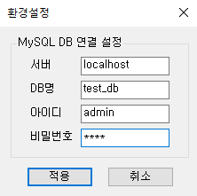
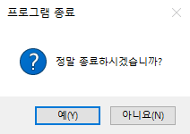

### - 프로젝트명
- 병원 의료 서비스 관리 ERP 프로그램 (의료 서비스 웹 사이트 프로젝트 연계)

### - 개발 환경
- C#, MySQL DB, Visual Studio 2022

### - 주요 기능
- 의료 웹 사이트에서 사용자가 등록한 문진표(환자) 및 예약 정보를 검색, 수정, 삭제 기능
- 의료 웹 사이트에서는 조작 불가능한 병원 데이터 삽입, 수정, 삭제, 검색 기능
- 의료 웹 사이트에서 가입된 회원들의 정보 검색 및 회원 삭제 기능

### - 구동 과정
#### 1. 프로그램 시작, DB 접속

```c#
public partial class login_form : Form
{
    private string server;
    private string database;
    private string id;
    private string pw;
    private string connectionString;
    private MySqlConnection conn;

    public login_form()
    {
        InitializeComponent();
    }
    private void login_form_Load(object sender, EventArgs e)
    {
        login_pw_value.Focus();
    }
    private void login_button_Click(object sender, EventArgs e)
    {
        server = login_server_value.Text;
        database = login_db_value.Text;
        id = login_id_value.Text;
        pw = login_pw_value.Text;
        bool tf = false;    // 로그인 결과를 저장할 변수
    
        if (unlogin_box.Checked)    // 강제 실행 체크된경우
        {
            server = "unlogined";
            database = "unlogined";
            id = "unlogined";
            pw = "";
            tf = true;
        }
        else
        {
            connectionString = $"Server={server};Database={database};Uid={id};Pwd={pw};";
            conn = new MySqlConnection(connectionString);
            try
            {
                conn.Open();
                MessageBox.Show("접속에 성공 하였습니다.");
                tf = true;
            }
            catch (Exception ex)
            {
                MessageBox.Show("접속에 실패 하였습니다.\n" + ex.Message);
            }
            finally
            {
                conn.Close();
            }
        }
    
        if (tf == true)     // 로그인 성공시 혹은 강제 실행 한 경우
        {
            main_form main_form = new main_form(this, server, database, id, pw);
            this.Hide();    // 닫으면 프로그램이 종료되므로 숨겨야함
            main_form.Show();
        }
}
```

- 프로그램 실행시 먼저 로그인 폼이 실행되며, MySQL DB 로그인 정보를 입력하여 DB 서버 접속 및 프로그램 실행이 가능합니다.
- 강제 실행을 체크하고 로그인 버튼을 누르면 DB 연결 없이 메인 화면으로 진입 할 수 있습니다.

#### 2. 데이터 로드


```c#
public main_form(Form login_form, string login_server, string login_database, string login_id, string login_pw)
{
    InitializeComponent();
    loginform = login_form;
    server = login_server; // 로그인 폼에서 입력한 값을 전달 받음
    database = login_database;
    id = login_id;
    pw = login_pw;
    connectionString = $"Server={server};Database={database};Uid={id};Pwd={pw};";
    conn = new MySqlConnection(connectionString);
    progressform = new ProgressForm(); // 데이터 로딩중 문구를 띄울 폼
}

private async void main_form_Load(object sender, EventArgs e) // 비동기를 사용하지 않으면 progressform이 정상 작동하지 않고 멈추므로 비동기 작업 사용
{
    if (server != "unlogined" && database != "unlogined" && id != "unlogined" && pw != "")   // 강제 접속 하지않고 정상 로그인 한경우
    {
        progressform.Show();
        await LoadDataAsync(); // 전체 데이터를 비동기로 로드
        progressform.Close();
    }
}

private async Task LoadDataAsync()
{
    await Task.Run(() =>
    {
        LoadPatientInfo();  // 각 DB 정보를 불러오는 메서드
        LoadAppointmentInfo();
        LoadHospitalList();
        LoadUserInfo();
    });
}

private void LoadPatientInfo()
{
    try
    {
        conn.Open();
        string query = "SELECT p_id AS '환자번호', " +
            "p_user_id AS '등록 아이디', " +
            "p_name AS '이름', " +
            "CASE WHEN p_gender = 0 THEN '남자' WHEN p_gender = 1 THEN '여자' ELSE '알 수 없음' END AS '성별', " +
            "p_reg_num AS '주민번호 앞 6자리', " +
            "p_age AS '나이', " +
            "p_phone AS '전화번호', " +
            "p_address1 AS '주소', " +
            "p_address2 AS '주소상세', " +
            "p_insert_date_time AS '등록일시', " +
            "CASE WHEN p_taking_pill = 0 THEN '무' WHEN p_taking_pill = 1 THEN '유' ELSE '알 수 없음' END AS '약 복용 유무', " +
            "CASE WHEN p_nose = 0 THEN '무' WHEN p_nose = 1 THEN '유' ELSE '알 수 없음' END AS '콧물 혹은 코막힘', " +
            "CASE WHEN p_cough = 0 THEN '무' WHEN p_cough = 1 THEN '유' ELSE '알 수 없음' END AS '기침 또는 거래', " +
            "CASE WHEN p_pain = 0 THEN '무' WHEN p_pain = 1 THEN '유' ELSE '알 수 없음' END AS '통증', " +
            "CASE WHEN p_diarrhea = 0 THEN '무' WHEN p_diarrhea = 1 THEN '유' ELSE '알 수 없음' END AS '설사', " +
            "CASE WHEN p_covid19 = 0 THEN '무' WHEN p_covid19 = 1 THEN '유' WHEN p_covid19 = 2 THEN '모름' ELSE '알 수 없음' END AS 'Covid-19 감염 유무', " +
            "CASE WHEN p_high_risk_group = 0 THEN '59개월 이하의 소아' " +
            "WHEN p_high_risk_group = 1 THEN '임산부' " +
            "WHEN p_high_risk_group = 2 THEN '만성 폐질환' " +
            "WHEN p_high_risk_group = 3 THEN '당뇨' " +
            "WHEN p_high_risk_group = 4 THEN '암환자' " +
            "WHEN p_high_risk_group = 5 THEN '해당없음' " +
            "ELSE '알 수 없음' END AS '고위험군 분류', " +
            "p_vas AS '시각통증수치 (VAS)' " +
            "FROM patient"; // 출력할 데이터를 가져올 쿼리문

        MySqlDataAdapter adapter = new MySqlDataAdapter(query, conn);
        DataTable dataTable = new DataTable();
        adapter.Fill(dataTable);
        patient_list.Invoke(new Action(() => { patient_list.DataSource = dataTable; }));

        patient_list.AutoSizeColumnsMode = DataGridViewAutoSizeColumnsMode.None;
        patient_list.Columns["주소"].Width = 400;
    }
    catch (Exception ex)
    {
        MessageBox.Show("Error: " + ex.Message);
    }
    finally
    {
        conn.Close();
    }
}
```
- DB에 접속 성공시 메인폼이 실행되며 전체 DB를 불러옵니다.
- 강제 실행을 할 경우 메인폼은 실행되지만 로그인 정보가 없기 때문에 DB는 불러오지 않습니다.

#### 3. 환자 정보 데이터 수정 기능

```c#
private void patientedit_Click(object sender, EventArgs e)    // 메인 폼에서 환자 정보 수정 버튼을 누르면 실행
{
    if (patient_list.SelectedRows.Count > 0)    // 데이터 행을 선택한 경우
    {
        int selectedPatientId = Convert.ToInt32(patient_list.SelectedRows[0].Cells["환자번호"].Value);  // 선택된 행의 id를 가져옴
        patient_edit_form p_edit = new patient_edit_form(selectedPatientId, server, database, id, pw); // id와 DB로그인 정보를 수정 폼을 생성하며 전달
        DialogResult result = p_edit.ShowDialog();
        if(result == DialogResult.OK)   // 수정이 진행되었다면, 갱신을 위해 데이터 다시 로드
        {
            LoadPatientInfo();
        }
    }
    else
    {
        MessageBox.Show("수정할 환자를 선택하세요.");
    }
}
```
```c#
public partial class patient_edit_form : Form
{
    private MySqlConnection conn;
    private int patientId;
    private string server;
    private string database;
    private string id;
    private string pw;
    public patient_edit_form(int patientId, string server, string database, string id, string pw)
    {
        InitializeComponent();
        this.patientId = patientId;
        this.server = server;
        this.database = database;
        this.id = id;
        this.pw = pw;
        conn = new MySqlConnection($"Server={server};Database={database};Uid={id};Pwd={pw}");
    }

    private void patient_edit_form_Load(object sender, EventArgs e)
    {
        LoadPatientInfo();
    }

    private void LoadPatientInfo()  // 선택한 환자의 데이터를 불러와 출력
    {
        try
        {
            conn.Open();
            string query = "SELECT p_id, p_user_id, p_name, p_gender, p_reg_num, p_phone, p_address1, p_address2, " +
                           "p_age, p_nose, p_cough, p_diarrhea, p_pain, p_high_risk_group, p_taking_pill, p_vas, p_covid19 " +
                           "FROM patient WHERE p_id = @p_id";
            MySqlCommand cmd = new MySqlCommand(query, conn);
            cmd.Parameters.AddWithValue("@p_id", patientId);

            MySqlDataReader reader = cmd.ExecuteReader();
            if (reader.Read())
            {   
                // 환자의 인적사항 정보 가져와 출력
                p_id_value.Text = reader["p_id"].ToString();
                p_user_id_value.Text = reader["p_user_id"].ToString();
                p_name_value.Text = reader["p_name"].ToString();
                p_regnum_value.Text = reader["p_reg_num"].ToString();
                p_phone_value.Text = reader["p_phone"].ToString();
                p_address1_value.Text = reader["p_address1"].ToString();
                p_address2_value.Text = reader["p_address2"].ToString();
                p_age_value.Text = reader["p_age"].ToString();

                int gender = Convert.ToInt32(reader["p_gender"]);
                if (gender == 0)
                {
                    p_gender_male.Checked = true;
                }
                else if (gender == 1)
                {
                    p_gender_female.Checked = true;
                }
                // 환자의 증상 정보 가져와 체크 적용
                int p_nose = Convert.ToInt32(reader["p_nose"]);
                int p_cough = Convert.ToInt32(reader["p_cough"]);
                int p_diarrhea = Convert.ToInt32(reader["p_diarrhea"]);
                int p_pain = Convert.ToInt32(reader["p_pain"]);
                int p_high_risk_group = Convert.ToInt32(reader["p_high_risk_group"]);
                int p_taking_pill = Convert.ToInt32(reader["p_taking_pill"]);
                int p_vas = Convert.ToInt32(reader["p_vas"]);
                int p_covid19 = Convert.ToInt32(reader["p_covid19"]);
                if (p_nose == 1)     { p_nose_box.Checked = true; }
                if (p_cough == 1)    { p_cough_box.Checked = true; }
                if (p_diarrhea == 1) { p_diarrhea_box.Checked = true; }
                if (p_pain == 1)     { p_pain_box.Checked = true; }

                if      (p_high_risk_group == 0) { under59.Checked = true; }
                else if (p_high_risk_group == 1) { pragnants.Checked = true; }
                else if (p_high_risk_group == 2) { lung.Checked = true; }
                else if (p_high_risk_group == 3) { diabetes.Checked = true; }
                else if (p_high_risk_group == 4) { cancer.Checked = true; }
                else                             { none.Checked = true; }

                if (p_taking_pill == 0) { p_taking_pill_no.Checked = true; }
                else                    { p_taking_pill_yes.Checked = true; }

                if      (p_covid19 == 0) { covid19no.Checked = true; }
                else if (p_covid19 == 1) { covid19yes.Checked = true; }
                else                     { covid19none.Checked = true; }

                p_vas_range.Value = p_vas;  // range bar에 적용
                p_vas_value.Text = p_vas_range.Value.ToString(); // range bar값을 숫자로도 출력

            }
            reader.Close();
        }
        catch (Exception ex)
        {
            MessageBox.Show("오류: " + ex.Message);
        }
        finally
        {
            conn.Close();
        }
    }


    private void save_button_Click(object sender, EventArgs e)
    {
        try
        {   // 저장 버튼을 누르면 입력된 값들을 가져와 DB에 저장 및 적용
            int gender = 0;
            int p_taking_pill = 0;
            int p_nose = 0;
            int p_cough = 0;
            int p_diarrhea = 0;
            int p_pain = 0;
            int p_high_risk_group = 0;
            int p_covid19 = 0;
            if      (p_gender_male.Checked)   { gender = 0; }
            else if (p_gender_female.Checked) { gender = 1; }

            if      (p_taking_pill_no.Checked)  { p_taking_pill = 0; }
            else if (p_taking_pill_yes.Checked) { p_taking_pill = 1; }

            if (p_nose_box.Checked)     { p_nose = 1; }
            if (p_cough_box.Checked)    { p_cough = 1; }
            if (p_diarrhea_box.Checked) { p_diarrhea = 1; }
            if (p_pain_box.Checked)     { p_pain = 1; }

            if      (under59.Checked)   { p_high_risk_group = 0; }
            else if (pragnants.Checked) { p_high_risk_group = 1; }
            else if (lung.Checked)      { p_high_risk_group = 2; }
            else if (diabetes.Checked)  { p_high_risk_group = 3; }
            else if (cancer.Checked)    { p_high_risk_group = 4; }
            else if (none.Checked)      { p_high_risk_group = 5; }

            if (covid19no.Checked)        { p_covid19 = 0; }
            else if (covid19yes.Checked)  { p_covid19 = 1; }
            else if (covid19none.Checked) { p_covid19 = 2; }
            
            conn.Open();
            string query = "UPDATE patient SET p_name = @p_name, p_gender = @p_gender, p_reg_num = @p_reg_num, " +
                           "p_phone = @p_phone, p_address1 = @p_address1, p_address2 = @p_address2, p_age = @p_age, "+
                           "p_taking_pill = @p_taking_pill, p_nose = @p_nose, p_cough = @p_cough, p_diarrhea = @p_diarrhea, "+
                           "p_pain = @p_pain, p_high_risk_group = @p_high_risk_group, p_vas = @p_vas, p_covid19 = @p_covid19 "+ 
                           "WHERE p_id = @p_id";
            MySqlCommand cmd = new MySqlCommand(query, conn);

            cmd.Parameters.AddWithValue("@p_id", patientId);
            cmd.Parameters.AddWithValue("@p_name", p_name_value.Text);
            cmd.Parameters.AddWithValue("@p_age", p_age_value.Text);
            cmd.Parameters.AddWithValue("@p_gender", gender);
            cmd.Parameters.AddWithValue("@p_reg_num", p_regnum_value.Text);
            cmd.Parameters.AddWithValue("@p_phone", p_phone_value.Text);
            cmd.Parameters.AddWithValue("@p_address1", p_address1_value.Text);
            cmd.Parameters.AddWithValue("@p_address2", p_address2_value.Text);
            cmd.Parameters.AddWithValue("@p_taking_pill", p_taking_pill);
            cmd.Parameters.AddWithValue("@p_nose", p_nose);
            cmd.Parameters.AddWithValue("@p_cough", p_cough);
            cmd.Parameters.AddWithValue("@p_diarrhea", p_diarrhea);
            cmd.Parameters.AddWithValue("@p_pain", p_pain);
            cmd.Parameters.AddWithValue("@p_high_risk_group", p_high_risk_group);
            cmd.Parameters.AddWithValue("@p_vas", p_vas_value.Text);
            cmd.Parameters.AddWithValue("@p_covid19", p_covid19);
            cmd.ExecuteNonQuery();
            MessageBox.Show("환자 정보가 수정되었습니다.");
            this.DialogResult = DialogResult.OK;    // 목록을 갱신하기위해 결과를 전달
            this.Close();
        }
        catch (Exception ex)
        {
            MessageBox.Show("오류: " + ex.Message);
        }
        finally
        {
            conn.Close();
        }
    }


    private void cancel_button_Click(object sender, EventArgs e)
    {
        this.Close();
    }

    private void bar_Scroll(object sender, EventArgs e)
    {
        // range bar가 움직이면 실시간으로 해당 값을 표시
        p_vas_value.Text = p_vas_range.Value.ToString();
    }

    private void box_Changed(object sender, EventArgs e)
    {
        // range bar와 text박스 입력값을 연동
        if(int.TryParse(p_vas_value.Text, out int result))
        {
            if(result >= 0 && result <= 10) // range bar 범위에 타당한 값이 입력되면 range bar 위치 조정
            {
                p_vas_range.Value = result;
            }
            else
            {
                MessageBox.Show("0에서 10 사이의 값을 입력해주세요.");
                p_vas_range.Value = 0;  // 잘못된 값 입력 시 저장되는것을 방지하기 위해 0으로 강제 초기화
                p_vas_value.Text = "0";
            }
        }
        else
        {
            MessageBox.Show("숫자를 입력해주세요.");
            p_vas_range.Value = 0;
            p_vas_value.Text = "0";
        }
    }
}
```

- 데이터를 선택하고 수정 버튼을 누르면 새 창에서 해당 환자의 데이터를 불러오며, 환자 primary key인 id와 등록 회원 id를 제외한 데이터 수정이 가능합니다.
- 수정 버튼을 누르면 DB의 데이터가 수정되고 창이 닫히며, 메인으로 돌아와 목록을 갱신합니다.


#### 5. 환자 정보 데이터 삭제 기능

```c#
private void patientdelete_Click(object sender, EventArgs e)
{
    bool result = DeleteData(patient_list, "환자번호", "patient", "p_id"); // DataGridView, 한글명, 테이블명, id명
    if (result == true) { LoadPatientInfo(); }  // 정상 삭제한 경우 데이터 갱신
}

 private bool DeleteData(DataGridView dataGridView, string tableNameKor, string tableName, string idStyle)
{
    if (dataGridView.SelectedRows.Count == 0) // 데이터를 선택 하지 않고 삭제를 누른 경우
    {
        MessageBox.Show("삭제할 데이터를 선택해주세요.");
        return false;
    }

    List<int> selectedId = new List<int>();
    foreach (DataGridViewRow row in dataGridView.SelectedRows)
    {
        selectedId.Add(Convert.ToInt32(row.Cells[tableNameKor].Value)); // 선택된 행들의 id를 리스트에 추가
    }
    string table;
    if (tableName == "patient") { table = "환자"; }
    else if (tableName == "appointment") { table = "예약"; }
    else if (tableName == "v_hospital_v1") { table = "병원"; }
    else { table = ""; }
    var result = MessageBox.Show($"{selectedId.Count}개의 {table} 정보를 삭제합니다.\n계속하시겠습니까?",
                                 $"{table} 삭제 확인", MessageBoxButtons.YesNo, MessageBoxIcon.Warning);
    if (result == DialogResult.No)
    {
        return false;
    }

    conn.Open();
    try
    {
        foreach (int id in selectedId)  // 리스트에 저장된 id에 해당하는 데이터 삭제
        {
            string query = $"DELETE FROM {tableName} WHERE {idStyle} = @id";
            MySqlCommand cmd = new MySqlCommand(query, conn);
            cmd.Parameters.AddWithValue("@id", id);
            cmd.ExecuteNonQuery();
        }
        MessageBox.Show($"{table} 정보가 삭제되었습니다.");
        conn.Close();
        return true;    // 정상적으로 삭제 한 경우에만 true 반환 후 메서드 종료

    }
    catch (Exception ex)
    {
        MessageBox.Show("오류: " + ex.Message);
        conn.Close();
    }
    return false;
}


```

- 데이터를 선택한 후 삭제 버튼을 누르면 경고 창이 띄워지며, 확인을 누르면 해당 데이터들이 삭제되고 목록이 갱신됩니다.

#### 6. 환자 정보 데이터 검색 기능


```c#
public partial class patient_search_form : Form
{
    public static string SearchFirst { get; set; }  // 첫번째 텍스트 박스 입력값
    public static string SearchSecond { get; set; } // 두번째 텍스트 박스 입력값

    public patient_search_form()
    {
        InitializeComponent();
    }

    public void patient_search_Click(object sender, EventArgs e)
    {
        SearchFirst = patient_search_name_value.Text;
        SearchSecond = patient_search_regnum_value.Text;
        DialogResult = DialogResult.OK;
        this.Close();
    }
    public void patient_search_Cancel(object sender, EventArgs e)
    {
        DialogResult = DialogResult.Cancel;
        this.Close();
    }
}
```
```c#
private void patient_search_Click(object sender, EventArgs e)
{
    patient_search_form patientsearchform = new patient_search_form();
    patientsearchform.ShowDialog();
    if(patientsearchform.DialogResult == DialogResult.OK)   // 검색창에서 검색 버튼을 누른 경우
    {
        try
        {
            conn.Open();
            string firstinput = patient_search_form.SearchFirst;    // 검색폼에 설정된 값을 가져옴
            string secondinput = patient_search_form.SearchSecond;
            string query = "SELECT p_id AS '환자번호', " +
                       "p_user_id AS '등록 아이디', " +
                       "p_name AS '이름', " +
                       "CASE WHEN p_gender = 0 THEN '남자' WHEN p_gender = 1 THEN '여자' ELSE '알 수 없음' END AS '성별', " +
                       "p_reg_num AS '주민번호 앞 6자리', " +
                       "p_age AS '나이', " +
                       "p_phone AS '전화번호', " +
                       "p_address1 AS '주소', " +
                       "p_address2 AS '주소상세', " +
                       "p_insert_date_time AS '등록일시', " +
                       "CASE WHEN p_taking_pill = 0 THEN '무' WHEN p_taking_pill = 1 THEN '유' ELSE '알 수 없음' END AS '약 복용 유무', " +
                       "CASE WHEN p_nose = 0 THEN '무' WHEN p_nose = 1 THEN '유' ELSE '알 수 없음' END AS '콧물 혹은 코막힘', " +
                       "CASE WHEN p_cough = 0 THEN '무' WHEN p_cough = 1 THEN '유' ELSE '알 수 없음' END AS '기침', " +
                       "CASE WHEN p_pain = 0 THEN '무' WHEN p_pain = 1 THEN '유' ELSE '알 수 없음' END AS '통증', " +
                       "CASE WHEN p_diarrhea = 0 THEN '무' WHEN p_diarrhea = 1 THEN '유' ELSE '알 수 없음' END AS '설사', " +
                       "CASE WHEN p_covid19 = 0 THEN '무' WHEN p_covid19 = 1 THEN '유' WHEN p_covid19 = 2 THEN '모름' ELSE '알 수 없음' END AS 'Covid-19 감염 유무', " +
                       "CASE WHEN p_high_risk_group = 0 THEN '59개월 이하의 소아' " +
                       "WHEN p_high_risk_group = 1 THEN '임산부' " +
                       "WHEN p_high_risk_group = 2 THEN '만성 폐질환' " +
                       "WHEN p_high_risk_group = 3 THEN '당뇨' " +
                       "WHEN p_high_risk_group = 4 THEN '암환자' " +
                       "WHEN p_high_risk_group = 5 THEN '해당없음' " +
                       "ELSE '알 수 없음' END AS '고위험군 분류', " +
                       "p_vas AS '시각통증수치 (VAS)' " +
                       "FROM patient " +
                       "WHERE p_name LIKE @p_name AND p_reg_num LIKE @p_reg_num";   // LIKE %_%를 사용하여, 값이 포함된 모든 데이터 검색
            MySqlCommand cmd = new MySqlCommand(query, conn);
            cmd.Parameters.AddWithValue("@p_name", "%" + firstinput + "%");
            cmd.Parameters.AddWithValue("@p_reg_num", "%" + secondinput + "%");
            MySqlDataReader reader = cmd.ExecuteReader();
            DataTable dataTable = new DataTable();
            dataTable.Load(reader);
            patient_list.DataSource = dataTable;    // 데이터 출력

            int resultCount = dataTable.Rows.Count;
            if (resultCount > 0)
            {
                MessageBox.Show($"총 {resultCount}개의 데이터가 검색 되었습니다.");
            }
            else
            {
                MessageBox.Show("검색된 데이터가 없습니다.");
            }
        }
        catch(Exception ex)
        {
            MessageBox.Show("Error: " + ex.Message);
        }
        finally
        {
            conn.Close();
        }
    }
}
```

- 검색 버튼을 누르면 새 창이 열리며, 데이터에서 찾기 원하는 문구를 입력 후 검색 버튼을 누르면 해당 문구가 포함된 모든 데이터가 출력됩니다.
- 두 개의 TextBox중 하나의 값만 입력해도 작동합니다.

#### 7. 예약 정보 수정 (테이블 Join)

```c#
public partial class appointment_edit_form : Form
{
    private MySqlConnection conn;
    private int appointmentId;
    private string server;
    private string database;
    private string id;
    private string pw;

    public appointment_edit_form(int appointmentId, string server, string database, string id, string pw)
    {
        InitializeComponent();
        this.appointmentId = appointmentId;
        this.server = server;
        this.database = database;
        this.id = id;
        this.pw = pw;
        conn = new MySqlConnection($"Server={server};Database={database};Uid={id};Pwd={pw}");
    }
    private void appointment_edit_form_Load(object sender, EventArgs e)
    {
        LoadAppointmentInfo();
    }

    private void LoadAppointmentInfo()
    {
        try
        {
            conn.Open();
            string query = "SELECT a.id, a.appointment_time, a.created_time, " +
           "a.patient_name, a.h_id, a.user_id, " +
           "h.h_name AS hospital_name, h.h_department, h.h_categorie, h.h_phone_number, h.h_region, h.h_address, " +
           "u.user_name, u.user_reg_num, u.user_gender, u.user_phone, u.user_address1, u.user_address2 " +
           "FROM appointment a " +
           "JOIN d_hospital_v1 h ON a.h_id = h.h_id " +
           "JOIN user u ON a.user_id = u.user_id " +
           "WHERE a.id = @id";

            MySqlCommand cmd = new MySqlCommand(query, conn);
            cmd.Parameters.AddWithValue("@id", appointmentId);
            MySqlDataReader reader = cmd.ExecuteReader();

            if (reader.Read())  // 예약자 정보, 병원 정보, 예약 시간 정보 표시
            {
                appointment_id_value.Text = reader["id"].ToString();
                patient_name_value.Text = reader["patient_name"].ToString();
                h_id_value.Text = reader["h_id"].ToString();
                user_id_value.Text = reader["user_id"].ToString();
                created_time_value.Text = reader["created_time"].ToString();
                hospital_name_value.Text = reader["hospital_name"].ToString();

                // 날짜 변환
                string appointmentTimeString = reader["appointment_time"].ToString();
                DateTime appointmentTime = DateTime.Parse(appointmentTimeString);
                appointment_year_value.Text = appointmentTime.Year.ToString();
                appointment_month_value.Text = appointmentTime.Month.ToString("D2");  // 2자리 단위로 끊어서 표시
                appointment_day_value.Text = appointmentTime.Day.ToString("D2");
                appointment_hour_value.Text = appointmentTime.Hour.ToString("D2");
                appointment_minute_value.Text = appointmentTime.Minute.ToString("D2");

                int gender = Convert.ToInt32(reader["user_gender"]);
                if(gender == 0) {user_gender_value.Text = "남성";}
                else            {user_gender_value.Text = "여성";}

                user_name_value.Text = reader["user_name"].ToString();
                user_regnum_value.Text = reader["user_reg_num"].ToString();
                user_address1_value.Text = reader["user_address1"].ToString();
                user_address2_value.Text = reader["user_address2"].ToString();
                user_phone_value.Text = reader["user_phone"].ToString();
               
                hospital_department_value.Text = reader["h_department"].ToString();
                hospital_categorie_value.Text = reader["h_categorie"].ToString();
                hospital_phone_value.Text = reader["h_phone_number"].ToString();
                hospital_region_value.Text = reader["h_region"].ToString();
                hospital_address1_value.Text = reader["h_address"].ToString();
            }
            reader.Close();
        }
        catch (Exception ex)
        {
            MessageBox.Show("오류: " + ex.Message);
        }
        finally
        {
            conn.Close();
        }
    }


    private void appointment_edit_save_button_Click(object sender, EventArgs e)
    {
        try
        {   // 예약 정보 수정
            conn.Open();
            int year = Convert.ToInt32(appointment_year_value.Text);
            int month = Convert.ToInt32(appointment_month_value.Text);
            int day = Convert.ToInt32(appointment_day_value.Text);
            int hour = Convert.ToInt32(appointment_hour_value.Text);
            int minute = Convert.ToInt32(appointment_minute_value.Text);

            DateTime appointmentTime = new DateTime(year, month, day, hour, minute, 0);
            string appointmentTimeString = appointmentTime.ToString("yyyy-MM-dd HH:mm:ss"); // MySQL 형식 날짜로 변환

            string query = "UPDATE appointment SET patient_name = @patient_name, appointment_time = @appointment_time WHERE id = @id";
            MySqlCommand cmd = new MySqlCommand(query, conn);

            cmd.Parameters.AddWithValue("@id", Convert.ToInt32(appointment_id_value.Text));
            cmd.Parameters.AddWithValue("@patient_name", patient_name_value.Text);
            cmd.Parameters.AddWithValue("@appointment_time", appointmentTimeString);
            cmd.ExecuteNonQuery();

            MessageBox.Show("예약 정보가 수정되었습니다.");
            this.DialogResult = DialogResult.OK;
            this.Close();
        }
        catch (Exception ex)
        {
            MessageBox.Show("오류: " + ex.Message);
        }
        finally
        {
            conn.Close();
        }
    }
}
```

- 예약 정보 목록을 선택 후 수정 버튼을 누르면 해당 예약과 연결된 환자 id와 병원 id의 데이터를 Join 하여 불러옵니다.
- 예약 시간을 변경하고 수정 버튼을 누르면 예약 시간 정보가 변경됩니다.


#### 8. 병원 정보 등록

```c#
public partial class hospital_create_form : Form
{
    private string server;
    private string db;
    private string id;
    private string pw;
    private MySqlConnection conn;

    public hospital_create_form(string server, string db, string id, string pw)
    {
        InitializeComponent();
        conn = new MySqlConnection($"Server={server};Database={db};Uid={id};Pwd={pw}");
        this.server = server;
        this.db = db;
        this.id = id;
        this.pw = pw;
    }

    private void hospital_create_form_Load(object sender, EventArgs e)
    {
        LoadHospitalNumber();
    }

    private void LoadHospitalNumber()   // h_id (primary key) 값 설정을 위한 메서드
    {
        try
        {
            conn.Open();
            string query = "SELECT MAX(h_id) FROM d_hospital_v1"; // 가장 마지막 (높은) pk값을 불러옴
            MySqlCommand cmd = new MySqlCommand(query, conn);
            MySqlDataReader reader = cmd.ExecuteReader();
            if (reader.Read() && reader[0] != DBNull.Value) // DB가 있을경우
            {
                h_id_value.Text = (Convert.ToInt32(reader[0]) + 1).ToString();  // 불러온 가장 마지막 pk값에 1을 더하여 pk값 지정
            }
            else    // DB가 비어있을경우
            {
                h_id_value.Text = "1"; // 첫번째 데이터 이므로 1로 지정
            }
            reader.Close();
        }
        catch(Exception ex)
        {
            MessageBox.Show("오류: " + ex.Message);
        }
        finally
        {
            conn.Close();
        }
    }
    private void hospital_create_button_Click(object sender, EventArgs e)
    {
        try
        {
            conn.Open();
            string query = "INSERT INTO d_hospital_v1 (h_id, h_name, h_region, h_address, h_department, h_categorie, " +
                               "h_phone_number, bed_total, bed_general, bed_nursing, bed_intensive, bed_isolation, bed_psy, bed_clean, " +
                               "h_latitude, h_longitude) VALUES (@h_id, @h_name, @h_region, @h_address, @h_department, @h_categorie, " +
                               "@h_phone_number, @bed_total, @bed_general, @bed_nursing, @bed_intensive, @bed_isolation, @bed_psy, @bed_clean, " +
                               "@h_latitude, @h_longitude)";
            MySqlCommand cmd = new MySqlCommand(query, conn);
            cmd.Parameters.AddWithValue("@h_id", h_id_value.Text);  // 상단에서 지정된 pk 값으로 설정하며 이는 사용자가 임의로 수정할 수 없음
            cmd.Parameters.AddWithValue("@h_name", h_name_value.Text);  // 각종 병원 정보 삽입
            cmd.Parameters.AddWithValue("@h_region", h_region_value.Text);
            cmd.Parameters.AddWithValue("@h_address", h_address_value.Text);
            cmd.Parameters.AddWithValue("@h_department", h_department_value.Text);
            cmd.Parameters.AddWithValue("@h_categorie", h_categorie_value.Text);
            cmd.Parameters.AddWithValue("@h_phone_number", h_phone_number_value.Text);
            cmd.Parameters.AddWithValue("@bed_total", Convert.ToInt32(bed_total_value.Text));
            cmd.Parameters.AddWithValue("@bed_general", Convert.ToInt32(bed_general_value.Text));
            cmd.Parameters.AddWithValue("@bed_nursing", Convert.ToInt32(bed_nursing_value.Text));
            cmd.Parameters.AddWithValue("@bed_intensive", Convert.ToInt32(bed_intensive_value.Text));
            cmd.Parameters.AddWithValue("@bed_isolation", Convert.ToInt32(bed_isolation_value.Text));
            cmd.Parameters.AddWithValue("@bed_psy", Convert.ToInt32(bed_psy_value.Text));
            cmd.Parameters.AddWithValue("@bed_clean", Convert.ToInt32(bed_clean_value.Text));
            cmd.Parameters.AddWithValue("@h_latitude", 36.12345678);    // 위도 경도는 별도의 주소 변환 과정이 필요해 예시 값으로 설정
            cmd.Parameters.AddWithValue("@h_longitude", 128.12345678);
            cmd.ExecuteNonQuery();
            MessageBox.Show("병원 정보가 추가되었습니다.");
            this.DialogResult = DialogResult.OK;
            this.Close();
        }
        catch (Exception ex)
        {
            MessageBox.Show("오류: " + ex.Message);
        }
        finally
        {
            conn.Close();
        }
    }
```

- 병원 정보 탭에서 병원 정보 등록을 누르면 새 창이 뜨며, 병원 정보를 기입 후 버튼을 누르면 새로운 병원 정보가 DB에 저장됩니다.
- 병원 정보 테이블의 primary key 인 h_id를 생성 하기 위해 가장 마지막 h_id값을 찾고 1을 더하여 새로운 병원 정보의 primary key를 설정합니다.


#### 9. 회원 정보 강제 삭제 (회원과 연결된 예약 포함)

```c#
private void user_delete_Click(object sender, EventArgs e)
{
    if (user_list.SelectedRows.Count > 0)   // 데이터를 선택하고 삭제 버튼을 눌렀는데
    {
        List<string> selectedUserId = new List<string>();
        if (user_list.SelectedRows.Count == 1)  // 데이터가 1개인경우
        {
            var result = MessageBox.Show("해당 회원 정보 및 관련된 모든 예약 정보가 삭제됩니다.\n계속하시겠습니까?", "회원 삭제 확인", MessageBoxButtons.YesNo, MessageBoxIcon.Warning);
            if (result == DialogResult.No) { return; }
            selectedUserId.Add(Convert.ToString(user_list.SelectedRows[0].Cells["아이디"].Value));
        }
        else    // 데이터가 여러개인경우
        {
            var result = MessageBox.Show($"{user_list.SelectedRows.Count}명의 회원 정보 및 관련된 모든 예약 정보가 삭제됩니다.\n계속하시겠습니까?", "회원 삭제 확인", MessageBoxButtons.YesNo, MessageBoxIcon.Warning);
            if (result == DialogResult.No) { return; }
            for (int i = 0; i < user_list.SelectedRows.Count; i++)  // 리스트에 여러개의 아이디를 담음
            {
                selectedUserId.Add(Convert.ToString(user_list.SelectedRows[i].Cells["아이디"].Value));
            }
        }
        for (int i = 0; i < selectedUserId.Count; i++) {
            if (selectedUserId[i] == "admin")   // 관리자 계정이 선택 된 경우 작업 강제 중단
            {
                MessageBox.Show("관리자 계정은 삭제 할 수 없습니다.");
                return;
            }
        }
        try
        {
            conn.Open();
            for (int i = 0; i < selectedUserId.Count; i++)
            {
                string query1 = "DELETE FROM appointment WHERE user_id = @user_id"; // 회원과 예약은 참조 관계이기 때문에 예약을 먼저 삭제하지 않으면 회원 삭제가 불가능
                MySqlCommand cmd1 = new MySqlCommand(query1, conn);
                cmd1.Parameters.AddWithValue("@user_id", selectedUserId[i]);
                cmd1.ExecuteNonQuery();
            }
            for (int i = 0; i < selectedUserId.Count; i++)
            {
                string query2 = "DELETE FROM user WHERE user_id = @user_id";    // 회원 삭제
                MySqlCommand cmd2 = new MySqlCommand(query2, conn);
                cmd2.Parameters.AddWithValue("@user_id", selectedUserId[i]);
                cmd2.ExecuteNonQuery();
            }
            MessageBox.Show("회원 정보 및 예약 정보가 삭제되었습니다.");
            conn.Close();
            LoadAppointmentInfo();
            LoadUserInfo();
        }
        catch (Exception ex)
        {
            MessageBox.Show("오류: " + ex.Message);
        }
        finally
        {
            conn.Close();
        }
    }
    else
    {
        MessageBox.Show("삭제할 데이터를 선택해주세요.");
    }
}
```

- 회원 정보 탭에서 회원을 선택하고 삭제 버튼을 누르면 확인 경고 창이 뜨고, 확인 버튼을 누르면 선택된 회원과 연결된 예약 데이터를 모두 삭제하고, 회원 데이터를 삭제합니다.
- 관리자 계정이 선택된 경우 알림을 띄우며 작업을 중단합니다.

#### 10. DB 연결 설정 변경

```c#

private async void setting_Click(object sender, EventArgs e)
{
    setting_form settingsForm = new setting_form(server, database, id, pw); // 환경 설정 창 생성하며 현재 DB접속 정보 전달
    if (settingsForm.ShowDialog() == DialogResult.OK)   // DB접속 정보가 변경된 경우
    {
        server = settingsForm.Server;   // 변경된 값 저장
        database = settingsForm.Database;
        id = settingsForm.Id;
        pw = settingsForm.Pw;
        connectionString = $"Server={server};Database={database};Uid={id};Pwd={pw};";
        conn.ConnectionString = connectionString;
        await all_data_Load();
    }
}
private async Task all_data_Load()    // 데이터 리스트를 비우고, 새로 모두 불러옴
{
    patient_list.Columns.Clear();
    appointment_list.Columns.Clear();
    hospital_list.Columns.Clear();
    user_list.Columns.Clear();

    progressform = new ProgressForm();
    progressform.Show();
    await LoadDataAsync();
    progressform.Close();
}
```
```c#
public partial class setting_form : Form
{
    public string Server { get; private set; }
    public string Database { get; private set; }
    public string Id { get; private set; }
    public string Pw { get; private set; }
    private MySqlConnection conn;

    public setting_form(string server, string database, string id, string pw)
    {
        InitializeComponent();
        this.Server = server;   // 현재 연결된 DB 정보를 설정
        this.Database = database;
        this.Id = id;
        this.Pw = pw;
    }

    private void setting_Form_Load(object sender, EventArgs e)
    {
        server_value.Text = this.Server;    // 현재 값을 출력
        db_value.Text = this.Database;
        id_value.Text = this.Id;
        pw_value.Text = this.Pw;
    }
    private void setting_Save_Click(object sender, EventArgs e)
    {
        this.Server = server_value.Text;    // 입력 된 값을 가져와 저장
        this.Database = db_value.Text;
        this.Id = id_value.Text;
        this.Pw = pw_value.Text;

        string connString = $"Server={this.Server};Database={this.Database};Uid={this.Id};Pwd={this.Pw}";   // 입력된 값으로 연결 시도하여 유효한지 체크
        try
        {
            conn = new MySqlConnection(connString);
            conn.Open();
            MessageBox.Show("DB서버 연결에 성공했습니다.");
            this.DialogResult = DialogResult.OK;
            this.Close();
        }
        catch (Exception ex)
        {
            MessageBox.Show($"DB서버 연결 실패: {ex.Message}");
        }
        finally
        {
            conn.Close();
        }
    }
}


```

- 환경 설정 버튼을 누르면 새 창이 띄워지며, 현재 접속중인 DB의 정보를 불러옵니다.
- 다른 DB에 접속하길 원하는 경우, 값을 수정하여 적용 버튼을 누르면 해당 DB에 연결하여 새로운 데이터를 불러옵니다.

#### 11. 프로그램 종료

```c#
private void main_form_FormClosing(object sender, FormClosingEventArgs e)
{
    DialogResult result = MessageBox.Show("정말 종료하시겠습니까?", "프로그램 종료", MessageBoxButtons.YesNo, MessageBoxIcon.Question);
    if (result == DialogResult.No)
    {
        e.Cancel = true;
        return;
    }
    if (conn != null && conn.State == ConnectionState.Open) // DB 연결이 남아있는경우 연결 해제
    {
        conn.Close();
    }
    loginform.Close();      // Hide된 로그인 폼 제거
    Environment.Exit(0);    // 프로그램 종료
}
```

- 메인 화면에서 우측 상단 X 버튼을 누르면 확인창이 뜨며, 확인 버튼을 누르면 프로그램이 정상 종료 됩니다.

